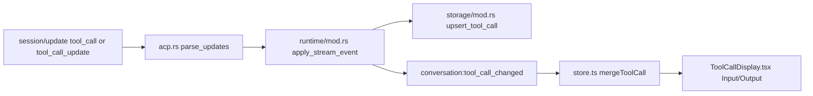

# Tool Call Input/Output 分析与修复计划

## 现状链路（OneAgent）

- ACP 解析：[`/Users/smkl/mydevelop/OneAgent/src-tauri/src/agent_adapters/acp.rs`](/Users/smkl/mydevelop/OneAgent/src-tauri/src/agent_adapters/acp.rs)
  - `tool_call`/`tool_call_update` 仅从 `update.input` 读取输入，缺失时默认 `{}`。
- Runtime 投影：[`/Users/smkl/mydevelop/OneAgent/src-tauri/src/runtime/mod.rs`](/Users/smkl/mydevelop/OneAgent/src-tauri/src/runtime/mod.rs)
  - `RuntimeStreamEvent::ToolCall` 直接覆盖 `raw_input_json` 到投影对象。
- 数据库存储：[`/Users/smkl/mydevelop/OneAgent/src-tauri/src/storage/mod.rs`](/Users/smkl/mydevelop/OneAgent/src-tauri/src/storage/mod.rs)
  - `ON CONFLICT(id)` 仅更新 `raw_output_json` 等字段，不更新 `raw_input_json`。
- 前端渲染：[`/Users/smkl/mydevelop/OneAgent/src/components/chat/ToolCallDisplay.tsx`](/Users/smkl/mydevelop/OneAgent/src/components/chat/ToolCallDisplay.tsx)
  - 直接 `JSON.stringify(raw_input_json)`，空对象会显示为 `{}`（看起来像“没有 Input”）。
- 状态合并：[`/Users/smkl/mydevelop/OneAgent/src/lib/store.ts`](/Users/smkl/mydevelop/OneAgent/src/lib/store.ts)
  - `mergeToolCall` 是整对象替换，不做字段级“保留非空旧值”。

## 关键问题（Input 为空的高概率根因）

1. ACP 更新包不保证每次都带输入；协议允许只传变化字段，`tool_call_update` 常见仅有 `status/content`。
2. 解析器对缺失输入直接写 `{}`，导致空输入进入后续链路。
3. 前端无“非空回填”逻辑，后到达的空输入更新会覆盖已有对象。
4. 持久化层冲突更新不刷新 `raw_input_json`，会造成“历史数据长期为空或陈旧”。
5. 权限事件链有字段不一致：
   - 记录 `PermissionRequested` 时未写 `raw_input`：[`/Users/smkl/mydevelop/OneAgent/src-tauri/src/runtime/mod.rs`](/Users/smkl/mydevelop/OneAgent/src-tauri/src/runtime/mod.rs)
   - 前端却读取 `payload.raw_input`：[`/Users/smkl/mydevelop/OneAgent/src/App.tsx`](/Users/smkl/mydevelop/OneAgent/src/App.tsx)

## 对照实现（AionUi）

- 核心做法：在 `tool_call_update` 时合并保留旧 `rawInput`，仅在新值存在时覆盖：[`/Users/smkl/mydevelop/GithubProjects/AionUi/src/process/agent/acp/AcpAdapter.ts`](/Users/smkl/mydevelop/GithubProjects/AionUi/src/process/agent/acp/AcpAdapter.ts)
- 按 `toolCallId` 做稳定消息合并，避免后续增量更新丢失已有字段：[`/Users/smkl/mydevelop/GithubProjects/AionUi/src/common/chat/chatLib.ts`](/Users/smkl/mydevelop/GithubProjects/AionUi/src/common/chat/chatLib.ts)
- 已有针对“Input 为空”回归测试（#1113）。

## 建议修复策略（待你确认后实施）

- 后端 ACP 解析增强：同时兼容 `input` 与 `rawInput`（优先非空值）。
- Runtime/Store 合并策略：`tool_call_update` 缺失输入时保留旧 `raw_input_json`，不要降级成 `{}`。
- DB upsert 策略：在冲突更新时，按“excluded 非空则覆盖，否则保留旧值”更新 `raw_input_json`。
- 权限事件补齐：`PermissionRequested` payload 增加 `raw_input`，前端读取字段对齐。
- 回归测试：补充 ACP `tool_call` + `tool_call_update` 多种顺序/缺字段场景。
