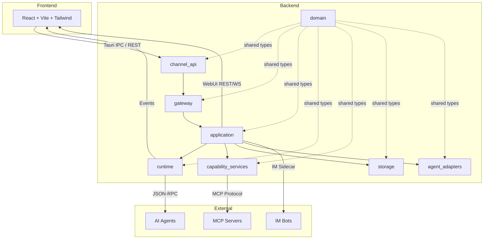

# OneAgent

<p align="right">
  <strong>English</strong> | <a href="./README.zh-CN.md">中文</a>
</p>

<p align="center">
  
</p>

<p align="center">
  <strong>A unified desktop & web workspace for multiple AI coding agents</strong>
</p>

<p align="center">
  Built with Tauri + ACP to manage Claude Code, OpenCode, Qwen Code, Gemini CLI, Kiro, OpenClaw, and more in one place with workspace isolation, conversation history, MCP integration, and permission controls.
</p>

<p align="center">
  <a href="#why-oneagent">Why OneAgent</a> •
  <a href="#highlights">Highlights</a> •
  <a href="#quick-start">Quick Start</a> •
  <a href="#supported-agents">Supported Agents</a> •
  <a href="#development">Development</a>
</p>

---

## Screenshots

### Main Workspace


### Chat Session


---

## Why OneAgent

When working with multiple AI coding agents, common pain points include fragmented terminals, split context, and unclear permission boundaries.  
OneAgent brings everything into a single desktop workspace:

- **One UI to manage multiple agents** — Switch between Claude Code, OpenCode, Qwen Code, and more without leaving the app
- **Workspace-level isolation** — Separate conversations, configurations, and MCP servers per project
- **Explicit permission decisions** — Review and approve high-risk actions like file writes and command execution
- **MCP-based extensibility** — Connect Model Context Protocol servers for custom tools and integrations
- **WebUI mode** — Access the same workspace from any browser with JWT authentication
- **IM integration** — Connect via Lark and WeChat bots for seamless collaboration

## Inspiration

This project is inspired by [AionUi](https://github.com/iOfficeAI/AionUi). At the current stage, OneAgent is still primarily a faithful recreation of that interaction model.

Our main implementation difference is the architecture choice: OneAgent is built as a desktop app with **Tauri + Rust** for the backend runtime, while keeping a modern frontend workflow.

---

## Highlights

### Unified Multi-Agent Access
- Standardized communication through **Agent Client Protocol (ACP)**
- Automatic discovery of locally installed agents
- Switch between agent profiles in the same UX
- Support for both Native and NpmAdapter launch modes

### Workspace and Session Management
- Multi-workspace isolation for chats, bindings, and config
- Persistent conversation history for replay and continuation
- IDE-like workflow with less context switching
- Timeline-based event tracking (messages, tool calls, terminal output)

### MCP Extensibility
- Connect Model Context Protocol (MCP) servers
- Configure tools and capability extensions per workspace
- Support for multiple transport protocols (stdio, HTTP)

### Granular Permission Controls
- Review sensitive operations such as file writes and command execution
- Supports `allow_once` / `allow_always` / `reject_once` / `reject_always`
- Real-time permission request notifications

### WebUI Mode
- Access the workspace from any browser
- JWT-based authentication with configurable password
- REST and WebSocket API for real-time updates
- Same backend as desktop mode — full feature parity

### IM Integration
- Lark (飞书) and WeChat bot integration via `im-sidecar`
- Seamless message routing and approval workflows
- Configurable per-workspace

### Design System
- Ollama-inspired minimalism with pure grayscale palette
- Three-tier border-radius system: 12px (containers), 8px (interactive), 9999px (pill)
- SF Pro Rounded for headlines, zero shadows
- Consistent spacing and typography rules

### Internationalization
- Built-in English and Chinese support
- Language preference stored in localStorage
- Easy to extend with new languages

---

## Architecture

### System Overview



### Backend Layers (Strict Unidirectional Dependency)

```
channel_api  →  gateway  →  application  →  runtime / capability_services / storage / agent_adapters
                  ↑ shared by all, depends on none ↑
                              domain
```

| Module | Responsibility |
|--------|---------------|
| `channel_api/` | Tauri IPC commands + WebUI server + IM channels. Must stay thin — no business logic. |
| `gateway/` | Facade aggregating services with lightweight validation. Not an orchestration layer. |
| `application/` | Use-case services owning transaction boundaries (create/import/send/cancel, permissions, attachments). |
| `runtime/` | Session lifecycle, streaming, event projection, recovery. |
| `agent_adapters/` | Protocol adapters for AI agents (ACP, compat). |
| `capability_services/` | MCP registry, skill discovery, policy engine, agent discovery, browser CDP, terminal. |
| `storage/` | SQLite database operations (workspaces, profiles, conversations, bindings, events). |
| `domain/` | Core types (Workspace, AgentProfile, Conversation, MessageProjection, etc.) and BackendError. **No Tauri, SQLite, or tokio dependencies.** |

### Agent Launch Flow

Agents launch in two modes:
- **Native** — direct command execution
- **NpmAdapter** — via bundled/system Bun or Node runtime

Runtime resolution priority: `BundledBun` → `SystemBun` → `SystemNode`  
Binary resolution priority: bundled Bun → system `bunx` → system `bun x` → system `npx`

### Event System

Frontend subscribes to real-time Tauri events via `src/lib/backend/events.ts`. Key event families:
- `conversation:*` — `state_changed`, `message_appended`, `message_updated`, `tool_call_changed`, `permission_requested`, `permission_resolved`, `terminal_output`, `turn_finished`, `deleted`
- `task_run:state_changed`
- `agent:profile_probed`

### Permission Flow

1. Runtime emits `conversation:permission_requested` event
2. Frontend shows pending permission UI
3. User decides: `allow_once` | `allow_always` | `reject_once` | `reject_always`
4. Frontend calls `resolvePermissionRequest`
5. Runtime forwards decision to adapter; agent continues

---

## Quick Start

### Requirements

- **macOS** 12+ / **Windows** 10+ / **Linux**
- **Node.js** 18+
- **Rust** 1.70+ (stable channel with clippy + rustfmt)
- **Git** (for cloning and submodules)

### Run from Source

```bash
# Clone the repository
git clone https://github.com/RaspberryCola/OneAgent.git
cd OneAgent

# Initialize git submodules (required for wechatbot)
git submodule update --init --recursive

# Install frontend dependencies
npm install

# Download bundled Bun and Claude ACP adapter (recommended once)
npm run prepare:claude-runtime

# Start full Tauri development mode
npm run tauri dev
```

### Build

```bash
# TypeScript check + Vite build
npm run build

# Full production build
npm run tauri build
```

### First Launch

1. On startup, OneAgent creates a default workspace at `~/.oneagent/workspace/`
2. The app automatically discovers available agent profiles
3. Select an agent profile and start a new conversation

---

## Usage

### Create a Session

1. Select an agent profile from the homepage
2. Create a new session and choose a target workspace
3. Enter your prompt and start the conversation

### Handle Permission Requests

When an agent asks for high-risk capabilities (such as file writes or command execution):
- Approve or reject in the permission dialog
- Choose one-time or persistent rules based on context

### WebUI Mode

1. Enable WebUI in Settings → General
2. Set a password (optional but recommended)
3. Access via `http://localhost:19520` (default port)
4. Login with your configured password

### IM Integration

1. Build the IM sidecar: `cd im-sidecar && npm install && npm run build`
2. Configure Lark or WeChat credentials in Settings → IM
3. Start the sidecar process
4. Messages will be routed through the configured channels

---

## Supported Agents

| Agent | Status | Integration | Launch Mode |
|------|------|------|------|
| Claude Code | ✅ | ACP Bridge | NpmAdapter |
| OpenCode | ✅ | ACP | Native |
| Qwen Code | ✅ | ACP | Native |
| Gemini CLI | ✅ | ACP | Native |
| Kiro | ✅ | ACP | Native |
| OpenClaw | ✅ | ACP | Native |
| Goose | ✅ | ACP | Native |
| Copilot | ✅ | ACP | Native |
| Codex | ✅ | ACP | Native |
| Cursor | ✅ | ACP | Native |
| Other ACP-compatible agents | 🚧 | Validation in progress | - |

**Adding New Agents:**
1. Install the agent CLI and ensure it's in your PATH
2. Run "Refresh Agent Discovery" from the UI
3. The agent will appear in the profile list if detected

---

## Development

### Common Commands

```bash
# Frontend dev server (Vite, port 1420)
npm run dev

# Tauri dev mode (frontend + backend)
npm run tauri dev

# Build (includes TypeScript checks)
npm run build

# Build desktop app
npm run tauri build

# Build Rust backend only
cd src-tauri && cargo build

# Run Rust tests
cd src-tauri && cargo test

# Lint Rust code
cd src-tauri && cargo clippy

# Frontend tests (Vitest)
npm run test                 # Watch mode
npm run test:run             # CI mode
npm run test -- src/lib/utils/__tests__/conversation.test.ts  # Single file

# IM sidecar (Lark/WeChat)
cd im-sidecar && npm install && npm run build
```

### Environment Variables

| Variable | Description | Default |
|----------|-------------|---------|
| `ONEAGENT_WEB_PORT` | WebUI server port | `19520` |
| `ONEAGENT_WEBUI_PASSWORD` | WebUI authentication password | (none) |
| `CLAUDE_API_KEY` | API key for Claude Code | (none) |
| `RUST_LOG` | Rust logging level | `info` |

### Debugging

- **Backend logs:** Check `tracing` output in the terminal
- **Frontend logs:** Open browser DevTools (F12)
- **Tauri IPC:** Use `console.log` in frontend code to trace command calls
- **Vitest:** Run `npm run test` for frontend unit tests

### Project Structure

```text
.
├── src/                    # React + TypeScript frontend
│   ├── components/         # UI components (chat, composer, settings, etc.)
│   ├── hooks/              # Custom React hooks
│   ├── i18n/               # Internationalization setup
│   ├── lib/                # State management, backend communication, utilities
│   ├── locales/            # Translation files (en, zh-CN)
│   ├── screens/            # Main screens (home, conversation, login)
│   └── assets/             # Static assets (SVGs, images)
├── src-tauri/              # Rust + Tauri backend
│   ├── src/                # Backend source code
│   │   ├── application/    # Use-case services
│   │   ├── runtime/        # Session management, streaming, projection
│   │   ├── agent_adapters/ # Protocol adapters (ACP, compat)
│   │   ├── storage/        # SQLite database operations
│   │   ├── capability_services/ # MCP, skills, policy engine
│   │   ├── domain/         # Core types and error definitions
│   │   ├── gateway/        # Facade layer
│   │   └── channel_api/    # Tauri IPC commands
│   ├── resources/          # Bundled resources (Bun runtime, external agents)
│   └── icons/              # App icons for all platforms
├── im-sidecar/             # Lark/WeChat IM integration
├── scripts/                # Build and preparation scripts
├── public/                 # Static assets (logos, etc.)
└── docs/                   # Design and architecture documentation
```

### Configuration Files

| File | Purpose |
|------|---------|
| `src-tauri/tauri.conf.json` | Tauri v2 app config, window settings, bundle resources |
| `src-tauri/Cargo.toml` | Rust dependencies |
| `src-tauri/capabilities/default.json` | Tauri v2 permissions for the main window |
| `src-tauri/rust-toolchain.toml` | Rust stable toolchain with clippy + rustfmt |
| `package.json` | Frontend dependencies and scripts |
| `tailwind.config.ts` | Tailwind config with custom grayscale palette and 3-tier border-radius |
| `tsconfig.json` | TypeScript strict mode, ESNext, `@/*` path alias |
| `vite.config.ts` | Vite + React + Vitest config (port 1420) |

---

## Design System

OneAgent follows an Ollama-inspired minimalism design language:

### Color Palette

- **Pure grayscale only** — no chromatic colors except focus ring
- **Primary:** Pure Black (`#000000`), Near Black (`#262626`)
- **Surfaces:** Pure White (`#ffffff`), Snow (`#fafafa`), Light Gray (`#e5e5e5`)
- **Text:** Stone (`#737373`), Mid Gray (`#525252`), Silver (`#a3a3a3`)
- **Accent:** Ring Blue (`#3b82f6` at 50%) — only for keyboard focus, never visible in normal flow

### Border Radius

Three-tier system:
- **12px (container):** Cards, panels, code blocks
- **8px (interactive):** Buttons, inputs, tabs, tags, badges
- **9999px (pill):** Reserved for homepage Agent switcher and toggle switches only

### Typography

- **Display:** SF Pro Rounded, weight 500
- **Body:** System sans-serif, weight 400
- **Monospace:** System monospace for code and terminal

### Depth

- **Zero shadows** — separation via background color shifts and 1px borders only
- **Flat aesthetic** — paper-like experience where elements are distinguished by content hierarchy

For detailed specifications, see `docs/FRONTEND_DESIGN.md`.

---

## Internationalization

OneAgent supports multiple languages with easy extensibility:

### Current Languages

- **English** (default)
- **Chinese** (中文)

### How It Works

- Translation files located in `src/locales/en/` and `src/locales/zh-CN/`
- Uses `i18next` + `react-i18next` for translation management
- Language preference stored in `localStorage: oneagent:language`
- Automatic language detection via browser settings

### Adding a New Language

1. Create a new directory: `src/locales/<lang>/`
2. Copy JSON files from `src/locales/en/` and translate them
3. Register the language in `src/i18n/index.ts`
4. Update `supportedLngs` array
5. Test the UI with the new language

---

## CI/CD & Release

### GitHub Actions Workflow

OneAgent uses GitHub Actions for automated releases:

- **Trigger:** Push a `v*` tag or manual `workflow_dispatch`
- **Platforms:** macOS, Ubuntu (deb), Windows (nsis)
- **Process:** 
  1. Checkout repository with submodules
  2. Setup Node.js 20 and Rust stable
  3. Sync version from tag via `scripts/sync-version.mjs`
  4. Install frontend dependencies (`npm ci`)
  5. Build and publish Tauri app

### Release Artifacts

| Platform | Format | Location |
|----------|--------|----------|
| macOS | `.dmg`, `.app` | GitHub Releases |
| Ubuntu | `.deb` | GitHub Releases |
| Windows | `.nsis` (installer) | GitHub Releases |

### Manual Release

```bash
# Update version in package.json and Cargo.toml
# Commit and tag
git tag v0.2.0
git push origin v0.2.0

# Or trigger manually via GitHub Actions UI
```

### Local Build

```bash
# Build for current platform
npm run tauri build

# Output location: src-tauri/target/release/bundle/
```

---

## Roadmap

- [ ] Validate and support more ACP-compatible agents
- [ ] Improve cross-platform packaging and install docs
- [ ] Add polished UI screenshots and demo GIFs
- [ ] Enhance WebUI mode with full feature parity
- [ ] Expand IM integration capabilities
- [ ] Add more language support
- [ ] Improve error handling and diagnostics
- [ ] Optimize performance for large workspaces

---

## Contributing

Issues and pull requests are welcome.  
Before submitting, please run:

```bash
# Frontend checks
npm run build
npm run test:run

# Backend checks
cd src-tauri && cargo test
cd src-tauri && cargo clippy

# Verify Tauri dev mode works
npm run tauri dev
```

### Code Style

- **Rust:** Follow `rustfmt` and `clippy` lints (configured in `rust-toolchain.toml`)
- **TypeScript:** Use strict mode (configured in `tsconfig.json`)
- **Design:** Follow the Ollama-inspired design system (see `docs/FRONTEND_DESIGN.md`)

### Testing

- **Frontend:** Vitest with jsdom environment
- **Backend:** Rust unit tests and integration tests
- **Manual:** Test Tauri dev mode and WebUI mode

---

## License

[MIT](LICENSE) © OneAgent Contributors

---

## Troubleshooting

**Runtime preparation fails:** Run `npm run prepare:claude-runtime` manually to download bundled Bun and Claude ACP adapter. Check network connectivity to GitHub.

**Agent not discovered:** Verify the agent CLI is in PATH. Run "Refresh Agent Discovery" from the UI or call `listAgentDiscoveryStatus` to diagnose.

**Conversation stuck in "initializing":** Check backend logs (`tracing` output) for adapter spawn errors. May indicate missing runtime (Bun/Node) or authentication issues (Claude requires `CLAUDE_API_KEY`).

**Frontend tests failing:** Ensure `jsdom` environment is correctly configured in `vite.config.ts`. Some tests may require Tauri API mocks.

**WebUI not accessible:** Check if the port is available and firewall settings. Verify the password is correctly configured in Settings → General.

**IM sidecar not working:** Ensure the sidecar is built (`cd im-sidecar && npm run build`) and credentials are correctly configured in Settings → IM.
