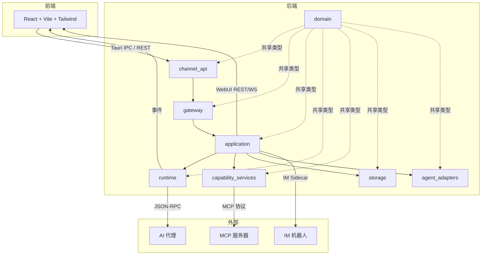

# OneAgent

<p align="right">
  <a href="./README.md">English</a> | <strong>中文</strong>
</p>

<p align="center">
  
</p>

<p align="center">
  <strong>一个桌面端与 Web 端的多 AI Coding Agent 统一工作台</strong>
</p>

<p align="center">
  基于 Tauri + ACP，统一管理 Claude Code、OpenCode、Qwen Code、Gemini CLI、Kiro、OpenClaw 等代理，提供工作区、会话历史、MCP 扩展与权限审批。
</p>

<p align="center">
  <a href="#为什么是-oneagent">为什么是 OneAgent</a> •
  <a href="#功能亮点">功能亮点</a> •
  <a href="#快速开始">快速开始</a> •
  <a href="#支持的代理">支持的代理</a> •
  <a href="#开发指南">开发指南</a>
</p>

---

## 截图

### 主界面


### 聊天页面


---

## 为什么是 OneAgent

使用多个 AI 编码代理时，常见痛点是：终端分散、上下文割裂、权限不可控。  
OneAgent 通过统一桌面界面把这些能力收敛到一个地方：

- **一套 UI 管理多个 Agent** — 在同一个应用中切换 Claude Code、OpenCode、Qwen Code 等，无需离开应用
- **工作区级别隔离** — 每个项目独立的对话、配置和 MCP 服务器
- **明确的权限决策** — 审查和批准文件写入、命令执行等高风险操作
- **MCP 可扩展能力** — 连接 Model Context Protocol 服务器，扩展自定义工具和集成
- **WebUI 模式** — 通过 JWT 认证从任何浏览器访问同一工作区
- **IM 集成** — 通过飞书和微信机器人实现无缝协作

## 灵感来源

这个项目的灵感来自 [AionUi](https://github.com/iOfficeAI/AionUi)。当前阶段，OneAgent 的功能形态仍以复刻其核心交互体验为主。

我们的主要差异在于技术实现路线：OneAgent 采用 **Tauri + Rust** 构建桌面端后端运行时，并结合现代前端工作流。

---

## 功能亮点

### 多 Agent 统一接入
- 基于 **Agent Client Protocol (ACP)** 做标准化通信
- 支持自动探测本机已安装代理
- 在同一个会话体验里切换不同 Agent Profile
- 支持 Native 和 NpmAdapter 两种启动模式

### 工作区与会话管理
- 多工作区隔离对话、绑定和配置
- 对话历史持久化，支持追溯和续聊
- 更接近 IDE 的交互方式，减少上下文切换
- 基于 Timeline 的事件追踪（消息、工具调用、终端输出）

### MCP 可扩展能力
- 支持接入 Model Context Protocol (MCP) 服务器
- 按工作区配置工具和能力扩展
- 支持多种传输协议（stdio、HTTP）

### 细粒度权限控制
- 文件写入、命令执行等敏感操作可审批
- 支持 `allow_once` / `allow_always` / `reject_once` / `reject_always`
- 实时权限请求通知

### WebUI 模式
- 通过任何浏览器访问工作区
- 基于 JWT 的认证，支持可配置密码
- REST 和 WebSocket API 实现实时更新
- 与桌面模式相同的后端 — 完整功能对等

### IM 集成
- 通过 `im-sidecar` 提供飞书和微信机器人集成
- 无缝的消息路由和审批工作流
- 按工作区配置

### 设计系统
- Ollama 启发的极简风格，纯灰度配色
- 三层圆角系统：12px（容器）、8px（交互元素）、9999px（药丸形）
- SF Pro Rounded 用于标题，零阴影
- 一致的间距和排版规则

### 国际化
- 内置英文和中文支持
- 语言偏好存储在 localStorage
- 易于扩展新语言

---

## 架构

### 系统概览



### 后端分层（严格单向依赖）

```
channel_api  →  gateway  →  application  →  runtime / capability_services / storage / agent_adapters
                  ↑ 被所有模块共享，不依赖上层 ↑
                              domain
```

| 模块 | 职责 |
|------|------|
| `channel_api/` | Tauri IPC 命令 + WebUI 服务器 + IM 渠道。必须保持精简 — 无业务逻辑。 |
| `gateway/` | 聚合服务的门面层，提供轻量级验证。不是业务编排层。 |
| `application/` | 用例服务，管理事务边界（创建/导入/发送/取消、权限、附件）。 |
| `runtime/` | 会话生命周期、流式处理、事件投影、恢复。 |
| `agent_adapters/` | AI 代理的协议适配器（ACP、compat）。 |
| `capability_services/` | MCP 注册表、技能发现、策略引擎、代理发现、浏览器 CDP、终端。 |
| `storage/` | SQLite 数据库操作（工作区、配置文件、对话、绑定、事件）。 |
| `domain/` | 核心类型（Workspace、AgentProfile、Conversation、MessageProjection 等）和 BackendError。**不依赖 Tauri、SQLite 或 tokio。** |

### 代理启动流程

代理以两种模式启动：
- **Native** — 直接命令执行
- **NpmAdapter** — 通过捆绑/系统 Bun 或 Node 运行时

运行时解析优先级：`BundledBun` → `SystemBun` → `SystemNode`  
二进制解析优先级：捆绑的 Bun → 系统 `bunx` → 系统 `bun x` → 系统 `npx`

### 事件系统

前端通过 `src/lib/backend/events.ts` 订阅实时 Tauri 事件。主要事件族：
- `conversation:*` — `state_changed`、`message_appended`、`message_updated`、`tool_call_changed`、`permission_requested`、`permission_resolved`、`terminal_output`、`turn_finished`、`deleted`
- `task_run:state_changed`
- `agent:profile_probed`

### 权限流程

1. 运行时发出 `conversation:permission_requested` 事件
2. 前端显示待处理权限 UI
3. 用户决定：`allow_once` | `allow_always` | `reject_once` | `reject_always`
4. 前端调用 `resolvePermissionRequest`
5. 运行时将决策转发给适配器；代理继续执行

---

## 快速开始

### 环境要求

- **macOS** 12+ / **Windows** 10+ / **Linux**
- **Node.js** 18+
- **Rust** 1.70+（稳定版，包含 clippy + rustfmt）
- **Git**（用于克隆和子模块）

### 从源码运行

```bash
# 克隆仓库
git clone https://github.com/RaspberryCola/OneAgent.git
cd OneAgent

# 初始化 git 子模块（wechatbot 必需）
git submodule update --init --recursive

# 安装前端依赖
npm install

# 下载捆绑的 Bun 和 Claude ACP 适配器（建议首次执行）
npm run prepare:claude-runtime

# 启动完整 Tauri 开发模式
npm run tauri dev
```

### 构建

```bash
# TypeScript 检查 + Vite 构建
npm run build

# 完整生产构建
npm run tauri build
```

### 首次启动

1. 启动后，OneAgent 会在 `~/.oneagent/workspace/` 创建默认工作区
2. 应用会自动发现可用的代理配置文件
3. 选择一个代理配置文件，开始新对话

---

## 使用说明

### 创建会话

1. 从主页选择代理配置文件
2. 创建新会话并选择目标工作区
3. 输入提示开始对话

### 处理权限请求

当代理请求高风险能力（如写文件、执行命令）时：
- 在弹窗中选择允许或拒绝
- 根据场景选择"一次性"或"长期规则"

### WebUI 模式

1. 在设置 → 通用中启用 WebUI
2. 设置密码（可选但建议）
3. 通过 `http://localhost:19520` 访问（默认端口）
4. 使用配置的密码登录

### IM 集成

1. 构建 IM sidecar：`cd im-sidecar && npm install && npm run build`
2. 在设置 → IM 中配置飞书或微信凭据
3. 启动 sidecar 进程
4. 消息将通过配置的渠道路由

---

## 支持的代理

| Agent | 状态 | 接入方式 | 启动模式 |
|------|------|------|------|
| Claude Code | ✅ | ACP Bridge | NpmAdapter |
| OpenCode | ✅ | ACP | Native |
| Qwen Code | ✅ | ACP | Native |
| Gemini CLI | ✅ | ACP | Native |
| Kiro | ✅ | ACP | Native |
| OpenClaw | ✅ | ACP | Native |
| Goose | ✅ | ACP | Native |
| Copilot | ✅ | ACP | Native |
| Codex | ✅ | ACP | Native |
| Cursor | ✅ | ACP | Native |
| 其他 ACP 兼容 Agent | 🚧 | 逐步验证中 | - |

**添加新代理：**
1. 安装代理 CLI 并确保其在 PATH 中
2. 从 UI 运行"刷新代理发现"
3. 如果检测到，代理将出现在配置文件列表中

---

## 开发指南

### 常用命令

```bash
# 前端开发服务器（Vite，端口 1420）
npm run dev

# Tauri 开发模式（前后端一起）
npm run tauri dev

# 构建（含 TypeScript 检查）
npm run build

# 构建桌面应用
npm run tauri build

# 仅构建 Rust 后端
cd src-tauri && cargo build

# 运行 Rust 测试
cd src-tauri && cargo test

# Lint Rust 代码
cd src-tauri && cargo clippy

# 前端测试（Vitest）
npm run test                 # 监视模式
npm run test:run             # CI 模式
npm run test -- src/lib/utils/__tests__/conversation.test.ts  # 单个文件

# IM sidecar（飞书/微信）
cd im-sidecar && npm install && npm run build
```

### 环境变量

| 变量 | 描述 | 默认值 |
|------|------|------|
| `ONEAGENT_WEB_PORT` | WebUI 服务器端口 | `19520` |
| `ONEAGENT_WEBUI_PASSWORD` | WebUI 认证密码 | （无） |
| `CLAUDE_API_KEY` | Claude Code 的 API 密钥 | （无） |
| `RUST_LOG` | Rust 日志级别 | `info` |

### 调试技巧

- **后端日志：** 检查终端中的 `tracing` 输出
- **前端日志：** 打开浏览器 DevTools（F12）
- **Tauri IPC：** 在前端代码中使用 `console.log` 追踪命令调用
- **Vitest：** 运行 `npm run test` 进行前端单元测试

### 项目结构

```text
.
├── src/                    # React + TypeScript 前端
│   ├── components/         # UI 组件（聊天、编辑器、设置等）
│   ├── hooks/              # 自定义 React hooks
│   ├── i18n/               # 国际化设置
│   ├── lib/                # 状态管理、后端通信、工具函数
│   ├── locales/            # 翻译文件（en、zh-CN）
│   ├── screens/            # 主要屏幕（主页、对话、登录）
│   └── assets/             # 静态资源（SVG、图片）
├── src-tauri/              # Rust + Tauri 后端
│   ├── src/                # 后端源代码
│   │   ├── application/    # 用例服务
│   │   ├── runtime/        # 会话管理、流式处理、投影
│   │   ├── agent_adapters/ # 协议适配器（ACP、compat）
│   │   ├── storage/        # SQLite 数据库操作
│   │   ├── capability_services/ # MCP、技能、策略引擎
│   │   ├── domain/         # 核心类型和错误定义
│   │   ├── gateway/        # 门面层
│   │   └── channel_api/    # Tauri IPC 命令
│   ├── resources/          # 捆绑资源（Bun 运行时、外部代理）
│   └── icons/              # 所有平台的应用图标
├── im-sidecar/             # 飞书/微信 IM 集成
├── scripts/                # 构建和准备脚本
├── public/                 # 静态资源（logo 等）
└── docs/                   # 设计和架构文档
```

### 配置文件

| 文件 | 用途 |
|------|------|
| `src-tauri/tauri.conf.json` | Tauri v2 应用配置、窗口设置、捆绑资源 |
| `src-tauri/Cargo.toml` | Rust 依赖 |
| `src-tauri/capabilities/default.json` | Tauri v2 主窗口权限 |
| `src-tauri/rust-toolchain.toml` | Rust 稳定版工具链，包含 clippy + rustfmt |
| `package.json` | 前端依赖和脚本 |
| `tailwind.config.ts` | Tailwind 配置，自定义灰度调色板和三层圆角 |
| `tsconfig.json` | TypeScript 严格模式、ESNext、`@/*` 路径别名 |
| `vite.config.ts` | Vite + React + Vitest 配置（端口 1420） |

---

## 设计系统

OneAgent 遵循 Ollama 启发的极简设计语言：

### 颜色调色板

- **纯灰度** — 除焦点环外无彩色
- **主要：** 纯黑（`#000000`）、近黑（`#262626`）
- **表面：** 纯白（`#ffffff`）、雪白（`#fafafa`）、浅灰（`#e5e5e5`）
- **文本：** 石材灰（`#737373`）、中灰（`#525252`）、银灰（`#a3a3a3`）
- **强调：** 环蓝（`#3b82f6` 的 50%）— 仅用于键盘焦点，正常流程中不可见

### 圆角

三层系统：
- **12px（容器）：** 卡片、面板、代码块
- **8px（交互）：** 按钮、输入框、标签页、标签、徽章
- **9999px（药丸形）：** 仅保留给主页代理切换器和开关

### 排版

- **显示：** SF Pro Rounded，字重 500
- **正文：** 系统无衬线字体，字重 400
- **等宽：** 系统等宽字体，用于代码和终端

### 深度

- **零阴影** — 仅通过背景颜色变化和 1px 边框分隔
- **平面美学** — 类似纸张的体验，元素通过内容层次区分

详细规范请参见 `docs/FRONTEND_DESIGN.md`。

---

## 国际化

OneAgent 支持多语言，易于扩展：

### 当前语言

- **英文**（默认）
- **中文**

### 工作原理

- 翻译文件位于 `src/locales/en/` 和 `src/locales/zh-CN/`
- 使用 `i18next` + `react-i18next` 进行翻译管理
- 语言偏好存储在 `localStorage: oneagent:language`
- 通过浏览器设置自动检测语言

### 添加新语言

1. 创建新目录：`src/locales/<lang>/`
2. 从 `src/locales/en/` 复制 JSON 文件并翻译
3. 在 `src/i18n/index.ts` 中注册语言
4. 更新 `supportedLngs` 数组
5. 使用新语言测试 UI

---

## CI/CD 与发布

### GitHub Actions 工作流

OneAgent 使用 GitHub Actions 进行自动化发布：

- **触发条件：** 推送 `v*` 标签或手动 `workflow_dispatch`
- **平台：** macOS、Ubuntu（deb）、Windows（nsis）
- **流程：**
  1. 检出仓库（含子模块）
  2. 设置 Node.js 20 和 Rust 稳定版
  3. 通过 `scripts/sync-version.mjs` 同步版本
  4. 安装前端依赖（`npm ci`）
  5. 构建并发布 Tauri 应用

### 发布产物

| 平台 | 格式 | 位置 |
|------|------|------|
| macOS | `.dmg`、`.app` | GitHub Releases |
| Ubuntu | `.deb` | GitHub Releases |
| Windows | `.nsis`（安装程序） | GitHub Releases |

### 手动发布

```bash
# 更新 package.json 和 Cargo.toml 中的版本
# 提交并打标签
git tag v0.2.0
git push origin v0.2.0

# 或通过 GitHub Actions UI 手动触发
```

### 本地构建

```bash
# 为当前平台构建
npm run tauri build

# 输出位置：src-tauri/target/release/bundle/
```

---

## 路线图

- [ ] 验证并支持更多 ACP 兼容代理
- [ ] 完善跨平台打包与安装文档
- [ ] 补齐 UI 截图与功能演示 GIF
- [ ] 增强 WebUI 模式，实现完整功能对等
- [ ] 扩展 IM 集成能力
- [ ] 添加更多语言支持
- [ ] 改进错误处理和诊断
- [ ] 优化大型工作区的性能

---

## 贡献

欢迎提交 Issue 和 Pull Request。  
提交前建议先运行：

```bash
# 前端检查
npm run build
npm run test:run

# 后端检查
cd src-tauri && cargo test
cd src-tauri && cargo clippy

# 验证 Tauri 开发模式正常工作
npm run tauri dev
```

### 代码风格

- **Rust：** 遵循 `rustfmt` 和 `clippy` 规则（在 `rust-toolchain.toml` 中配置）
- **TypeScript：** 使用严格模式（在 `tsconfig.json` 中配置）
- **设计：** 遵循 Ollama 启发的设计系统（参见 `docs/FRONTEND_DESIGN.md`）

### 测试

- **前端：** Vitest 配合 jsdom 环境
- **后端：** Rust 单元测试和集成测试
- **手动：** 测试 Tauri 开发模式和 WebUI 模式

---

## 许可证

[MIT](LICENSE) © OneAgent Contributors

---

## 故障排除

**运行时准备失败：** 手动运行 `npm run prepare:claude-runtime` 下载捆绑的 Bun 和 Claude ACP 适配器。检查到 GitHub 的网络连接。

**代理未发现：** 验证代理 CLI 在 PATH 中。从 UI 运行"刷新代理发现"或调用 `listAgentDiscoveryStatus` 进行诊断。

**对话卡在"初始化中"：** 检查后端日志（`tracing` 输出）中的适配器生成错误。可能表示缺少运行时（Bun/Node）或认证问题（Claude 需要 `CLAUDE_API_KEY`）。

**前端测试失败：** 确保在 `vite.config.ts` 中正确配置了 `jsdom` 环境。某些测试可能需要 Tauri API 模拟。

**WebUI 无法访问：** 检查端口是否可用和防火墙设置。验证密码是否在设置 → 通用中正确配置。

**IM sidecar 不工作：** 确保 sidecar 已构建（`cd im-sidecar && npm run build`）且凭据已在设置 → IM 中正确配置。
