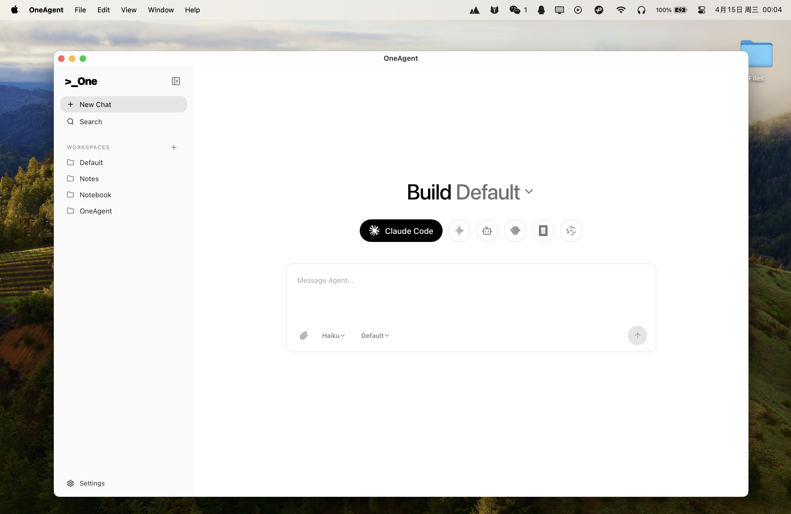
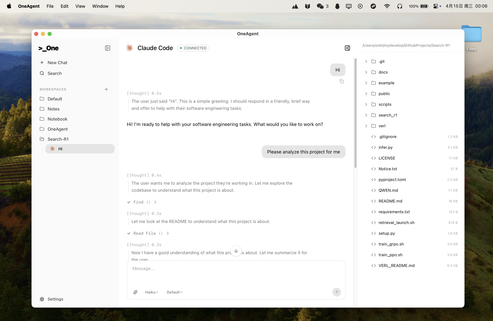

# OneAgent

<p align="right">
  <a href="./README.md">English</a> | <strong>中文</strong>
</p>

<p align="center">
  
</p>

<p align="center">
  <strong>一个桌面端的多 AI Coding Agent 统一工作台</strong>
</p>

<p align="center">
  基于 Tauri + ACP，统一管理 Claude Code、OpenCode、Qwen Code、Gemini CLI、Kiro、OpenClaw 等代理，提供工作区、会话历史、MCP 扩展与权限审批。
</p>

<p align="center">
  <a href="#功能亮点">功能亮点</a> •
  <a href="#快速开始">快速开始</a> •
  <a href="#使用说明">使用说明</a> •
  <a href="#支持的代理">支持的代理</a> •
  <a href="#开发指南">开发指南</a>
</p>

## 截图

### 主界面



### 聊天页面



---

## 为什么是 OneAgent

使用多个 AI 编码代理时，常见痛点是：终端分散、上下文割裂、权限不可控。  
OneAgent 通过统一桌面界面把这些能力收敛到一个地方：

- 一套 UI 管理多个 Agent
- 工作区级别会话和配置隔离
- 对高风险动作做明确的权限决策
- 通过 MCP 按需扩展工具能力

## 灵感来源

这个项目的灵感来自 [AionUi](https://github.com/iOfficeAI/AionUi)。当前阶段，OneAgent 的功能形态仍以复刻其核心交互体验为主。

我们的主要差异在于技术实现路线：OneAgent 采用 **Tauri + Rust** 构建桌面端后端运行时，并结合现代前端工作流。

## 功能亮点

### 多 Agent 统一接入
- 基于 **Agent Client Protocol (ACP)** 做标准化通信
- 支持自动探测本机已安装代理
- 在同一个会话体验里切换不同 Agent Profile

### 工作区与会话管理
- 多工作区隔离对话、绑定和配置
- 对话历史持久化，支持追溯和续聊
- 更接近 IDE 的交互方式，减少上下文切换

### MCP 可扩展能力
- 支持接入 Model Context Protocol (MCP) 服务器
- 按工作区配置工具和能力扩展

### 细粒度权限控制
- 文件写入、命令执行等敏感操作可审批
- 支持 `allow_once` / `allow_always` / `reject_once` / `reject_always`

## 快速开始

### 环境要求

- macOS 12+ / Windows 10+ / Linux
- Node.js 18+
- Rust 1.70+

### 从源码运行

```bash
git clone https://github.com/RaspberryCola/OneAgent.git
cd OneAgent

npm install

# 下载 bundled Bun 和 Claude ACP adapter（建议首次执行）
npm run prepare:claude-runtime

# 启动完整 Tauri 开发环境
npm run tauri dev
```

### 构建发布版本

```bash
npm run build
npm run tauri build
```

## 使用说明

### 首次启动
1. 启动后会默认创建 `~/.oneagent/workspace/` 工作区
2. 应用自动发现可用 Agent Profile

### 新建会话
1. 选择 Agent Profile
2. 点击新建会话并选择目标工作区
3. 输入任务开始对话

### 处理权限请求
当 Agent 请求高风险能力（如写文件、执行命令）时：
- 在弹窗中选择允许或拒绝
- 根据场景选择“一次性”或“长期规则”

## 支持的代理

| Agent | 状态 | 接入方式 |
|------|------|------|
| Claude Code | ✅ | ACP Bridge |
| OpenCode | ✅ | ACP |
| Qwen Code | ✅ | ACP |
| Gemini CLI | ✅ | ACP |
| Kiro | ✅ | ACP |
| OpenClaw | ✅ | ACP |
| 其他 ACP 兼容 Agent | 🚧 | 逐步验证中 |

## 开发指南

### 常用命令

```bash
# 前端开发服务器（Vite）
npm run dev

# Tauri 开发模式（前后端一起）
npm run tauri dev

# 构建（含 TypeScript 检查）
npm run build

# 构建桌面应用
npm run tauri build

# 仅构建 Rust 后端
cd src-tauri && cargo build

# 运行 Rust 测试
cd src-tauri && cargo test
```

### 项目结构（简版）

```text
.
├── src/                    # React + TypeScript 前端
├── src-tauri/              # Rust + Tauri 后端
├── scripts/                # 工具脚本（含 runtime 准备）
├── public/                 # 静态资源（logo 等）
└── docs/                   # 设计/架构文档
```

## 路线图

- [ ] 增加更多 ACP 兼容 Agent 适配验证
- [ ] 完善跨平台打包与安装文档
- [ ] 补齐 UI 截图与功能演示 GIF

## 贡献

欢迎提交 Issue 和 Pull Request。  
提交前建议先运行：

```bash
npm run build
cd src-tauri && cargo test
```

## 许可证

[MIT](LICENSE) © OneAgent Contributors
