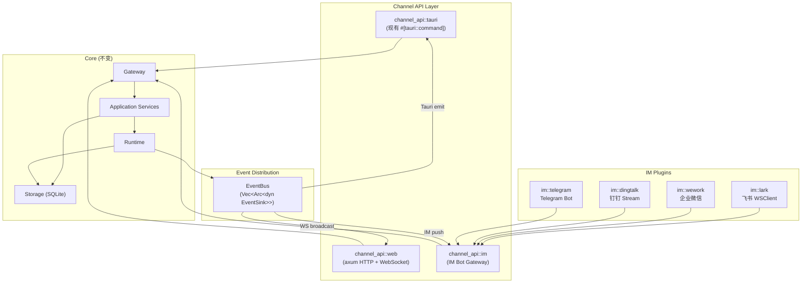
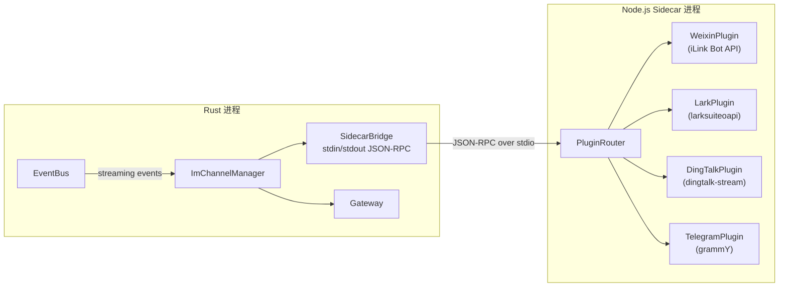
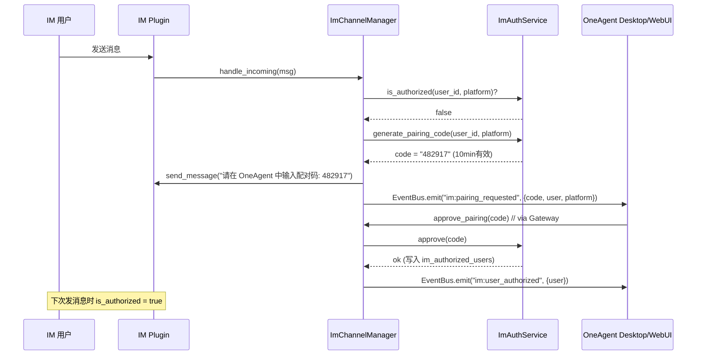

# OneAgent 多渠道消息能力设计方案

## 背景与目标

OneAgent 当前仅支持 Tauri 桌面端通过 IPC 通信。我们希望扩展为多渠道架构，让用户能够通过以下方式与 Agent 交互：

1. **Web 端**（PC/移动端浏览器）— 在无桌面环境（服务器、Docker）下通过网页使用
2. **IM 渠道**（飞书/企业微信/钉钉/Telegram）— 在手机聊天工具中远程操控 Agent

### AionUI 的做法及其问题

AionUI 在 Node.js 中用 Express + WebSocket 实现了 WebUI，用 grammY/larksuiteoapi/dingtalk-stream SDK 实现了 IM 渠道。其核心设计是：

| 优点 | 问题 |
| --- | --- |
| 统一消息协议 `IUnifiedMessage` | Node.js 全局单例模式(ChannelManager, PairingService 等)，单例过多导致初始化顺序脆弱 |
| BasePlugin 抽象基类 + 适配器模式 | Gateway 层和 Channel 层各自独立，没有共享同一个 facade，导致 WebUI 和 IM 走的是两套路径 |
| 500ms 流式节流控制 | 凭据只做 Base64 "加密"，安全性不足 |
| 三级降级策略 (DingTalk) | Channels 子系统独立于主业务层，session 管理重复实现 |

### 我们的改进方向

| 原则 | 具体做法 |
| --- | --- |
| **一个 Gateway，多个 channel_api** | 所有渠道（Tauri IPC / WebSocket / IM Bot）都经由同一个 `Gateway` 进入 `application` 层，杜绝重复业务逻辑 |
| **Rust 原生实现** | WebUI 的 HTTP/WebSocket 服务器用 `axum` 实现，直接嵌入 Tauri 进程或独立二进制；IM SDK 适配器也在 Rust 中实现 |
| **trait 驱动的 EventBus** | 用 `EventSink` trait 替代全局单例，runtime 不关心下游是 Tauri emitter 还是 WebSocket broadcaster 还是 IM 推送 |
| **复用现有分层** | `channel_api` 目录已存在且定位明确 — 就是"对外通道适配层"。我们只需要让它支持多种通道 |
| **数据库复用** | 通过扩展 `conversations` 表增加 `source` 和 `channel_chat_id` 列实现渠道隔离，而非另建一套表 |

---

## 整体架构



**关键设计：所有箭头最终都汇入同一个 Gateway，事件通过统一的 EventBus 反向分发。**

---

## Phase 1: WebUI 渠道

### 1.1 目录结构

```text
src-tauri/src/
  channel_api/
    mod.rs              # 现有 Tauri commands + 公共 re-exports
    tauri.rs            # (拆出) 纯 Tauri command 适配
    web/
      mod.rs            # axum 服务器启动、路由注册
      auth.rs           # JWT 认证 + 密码管理
      ws.rs             # WebSocket 连接管理、心跳、消息分发
      handlers.rs       # HTTP REST handlers (映射到 Gateway)
      middleware.rs     # CORS、auth guard
```

### 1.2 HTTP + WebSocket 服务器

#### [NEW] `channel_api/web/mod.rs`

使用 `axum` 启动一个嵌入式 HTTP 服务器：

- 在 Tauri 的 `setup` 阶段，`tokio::spawn` 一个 axum 服务
- 独立部署模式下（`--webui` flag），跳过 Tauri，直接 `axum::serve`
- 共享同一个 `Arc<Gateway>` 实例

```rust
// 伪代码
pub async fn start_web_server(gateway: Arc<Gateway>, port: u16, allow_remote: bool) {
    let state = WebState { gateway, auth: AuthService::new() };
    let app = Router::new()
        .nest("/api", api_routes())
        .route("/ws", get(ws_handler))
        .nest_service("/", ServeDir::new(renderer_path()))
        .layer(CorsLayer::new().allow_origin(...))
        .with_state(state);

    let addr = if allow_remote { "0.0.0.0" } else { "127.0.0.1" };
    let listener = TcpListener::bind(format!("{addr}:{port}")).await?;
    axum::serve(listener, app).await?;
}
```

#### [NEW] `channel_api/web/ws.rs`

WebSocket 连接管理：

- 连接建立时验证 JWT（从 cookie 或 query param 中取）
- 维护 `Arc<RwLock<Vec<WsSender>>>` 广播列表
- 实现 `EventSink` trait，收到 runtime 事件时广播给所有在线 WebSocket 客户端
- 心跳：30 秒 ping/pong，超时断开
- 客户端消息：反序列化为 `WebSocketMessage { name: String, data: Value }` 后路由到 Gateway

#### [MODIFY] 前端适配 `src/lib/backend/`

- 新增 `transport.ts`：检测环境（Tauri vs Browser），选择 IPC 或 WebSocket 通道
- `commands.ts` 中的 `invoke(...)` 改为通过 `transport` 层分发
- `events.ts` 中的 `listen(...)` 在 WebSocket 模式下改为监听 WS 消息

```typescript
// transport.ts
const IS_TAURI = '__TAURI__' in window;

export async function invoke<T>(command: string, args?: Record<string, unknown>): Promise<T> {
  if (IS_TAURI) {
    return tauriInvoke(command, args);
  }
  return wsInvoke(command, args);  // Send via WebSocket, await response
}
```

### 1.3 认证

- 首次启动生成随机密码，终端打印 + QR Code
- JWT + HttpOnly Cookie 认证
- 支持密码修改
- WebSocket 升级时验证 cookie 中的 JWT

### 1.4 EventSink trait

#### [NEW] `runtime/event_bus.rs`

```rust
/// 统一事件输出接口。Runtime 不关心谁在监听。
pub trait EventSink: Send + Sync {
    fn emit(&self, event: &str, payload: &serde_json::Value);
}

/// 多路分发器
pub struct EventBus {
    sinks: RwLock<Vec<Arc<dyn EventSink>>>,
}

impl EventBus {
    pub fn register(&self, sink: Arc<dyn EventSink>) { ... }
    pub fn broadcast(&self, event: &str, payload: &serde_json::Value) {
        for sink in self.sinks.read().iter() {
            sink.emit(event, payload);
        }
    }
}
```

#### [MODIFY] `runtime/mod.rs`

将现有的 `emitter: Arc<Mutex<Option<EventEmitter>>>` 替换为 `event_bus: Arc<EventBus>`。

现有 `attach_emitter` 改为 `register_sink`：
- Tauri 启动时注册 `TauriEventSink`
- WebUI 启动时注册 `WebSocketEventSink`
- IM 渠道启动时注册 `ImChannelEventSink`

---

## Phase 2: IM 渠道框架 (Rust 核心 + Node.js Sidecar)

### 2.1 架构：Rust 核心 + Node.js Sidecar



**为什么用 Sidecar**：
- IM 平台 SDK 生态集中在 Node.js（grammY / larksuiteoapi / dingtalk-stream / iLink）
- AionUI 已有完整的 TypeScript 插件实现，可直接移植
- Rust 侧只需薄适配器 `SidecarBridge`，维护成本极低
- Sidecar 崩溃不影响 Rust 主进程，可自动重启

### 2.2 目录结构

```text
src-tauri/src/
  channel_api/
    im/
      mod.rs              # ImChannelManager: 生命周期、事件分发
      plugin.rs           # ImPlugin trait 定义
      sidecar.rs          # SidecarBridge: 子进程管理 + JSON-RPC 通信
      session.rs          # IM 用户会话管理（per-chat 隔离）
      auth.rs             # 配对码授权服务
      crypto.rs           # AES-256-GCM 凭据加解密
      throttle.rs         # 流式响应节流器

im-sidecar/                # Node.js sidecar 项目
  package.json
  tsconfig.json
  src/
    index.ts              # 入口：stdin/stdout JSON-RPC server
    protocol.ts           # Rust ↔ Node 通信协议定义
    router.ts             # 消息路由到各插件
    plugins/
      base.ts             # BasePlugin 基类 (移植自 AionUI)
      weixin/             # 微信 iLink (移植自 AionUI)
      lark/               # 飞书
      dingtalk/           # 钉钉
      telegram/           # Telegram
```

### 2.2 核心 trait

#### [NEW] `channel_api/im/plugin.rs`

```rust
/// IM 平台插件的统一行为接口
#[async_trait]
pub trait ImPlugin: Send + Sync {
    fn platform(&self) -> &str;  // "lark", "wework", "dingtalk", "telegram"

    async fn start(&mut self, config: ImPluginConfig) -> Result<()>;
    async fn stop(&mut self) -> Result<()>;

    async fn send_message(&self, chat_id: &str, msg: OutgoingMessage) -> Result<String>;
    async fn edit_message(&self, chat_id: &str, msg_id: &str, msg: OutgoingMessage) -> Result<()>;

    fn status(&self) -> PluginStatus;
}

/// 统一入站消息（从 IM 平台进入系统）
pub struct IncomingMessage {
    pub id: String,
    pub platform: String,
    pub chat_id: String,          // 隔离键
    pub user_id: String,
    pub user_name: String,
    pub content: MessageContent,  // Text / Command / Action / Media
    pub timestamp: i64,
}

/// 统一出站消息（从系统推向 IM 平台）
pub struct OutgoingMessage {
    pub text: String,
    pub buttons: Option<Vec<ActionButton>>,
    pub is_streaming_update: bool,
}
```

### 2.3 ImChannelManager

#### [NEW] `channel_api/im/mod.rs`

```rust
pub struct ImChannelManager {
    gateway: Arc<Gateway>,
    plugins: RwLock<HashMap<String, Box<dyn ImPlugin>>>,
    sessions: ImSessionManager,
    auth: ImAuthService,
    event_bus: Arc<EventBus>,
}

impl ImChannelManager {
    /// 收到 IM 平台消息的统一入口
    pub async fn handle_incoming(&self, msg: IncomingMessage) -> Result<()> {
        // 1. 检查授权
        if !self.auth.is_authorized(&msg.user_id, &msg.platform) {
            return self.send_pairing_prompt(&msg).await;
        }
        // 2. 获取/创建 session
        let session = self.sessions.get_or_create(&msg.user_id, &msg.chat_id).await?;
        // 3. 路由到 Gateway
        match msg.content {
            MessageContent::Text(text) => {
                // 调用 gateway.send_user_message(...)
                // 注册流式回调 → 节流 → edit_message
            }
            MessageContent::Command(cmd) => { /* session.new, help, agent.switch 等 */ }
            MessageContent::Action(action) => { /* 按钮回调 */ }
        }
    }
}
```

**与 AionUI 的关键区别**：

| AionUI | OneAgent |
| --- | --- |
| `ActionExecutor` 直接操作 `WorkerManage` 和 DB | `ImChannelManager` 只调用 `Gateway`，不碰内部 |
| `ChannelMessageService` 是独立的消息发送层 | 直接复用 `Runtime` 的流式事件 + `EventSink` |
| `SessionManager` 独立实现了内存缓存 + DB 持久化 | 复用已有的 `conversations` 表，只需扩展列 |
| 插件代码和主进程强耦合 (同一 Node.js 进程) | 插件运行在独立 sidecar 进程，崩溃隔离 |

### 2.4 Rust ↔ Node.js JSON-RPC 协议

#### [NEW] `im-sidecar/src/protocol.ts`

```typescript
// Rust → Node (请求)
type RpcRequest =
  | { method: 'plugin.start'; params: { plugin_type: string; config: PluginConfig } }
  | { method: 'plugin.stop'; params: { plugin_type: string } }
  | { method: 'plugin.send_message'; params: { plugin_type: string; chat_id: string; message: OutgoingMessage } }
  | { method: 'plugin.edit_message'; params: { plugin_type: string; chat_id: string; msg_id: string; message: OutgoingMessage } }
  | { method: 'plugin.status'; params: { plugin_type: string } };

// Node → Rust (事件通知，无需响应)
type RpcNotification =
  | { method: 'incoming_message'; params: IncomingMessage }
  | { method: 'plugin_status_changed'; params: { plugin_type: string; status: PluginStatus } }
  | { method: 'plugin_error'; params: { plugin_type: string; error: string } };
```

#### [NEW] `channel_api/im/sidecar.rs`

```rust
pub struct SidecarBridge {
    child: Option<tokio::process::Child>,
    stdin: tokio::io::BufWriter<ChildStdin>,
    pending: Arc<Mutex<HashMap<u64, oneshot::Sender<Value>>>>,
}

impl SidecarBridge {
    pub async fn spawn(node_path: &str, sidecar_dir: &str) -> Result<Self> { ... }
    pub async fn call(&self, method: &str, params: Value) -> Result<Value> { ... }
    pub async fn restart(&mut self) -> Result<()> { ... }  // 崩溃自动重启
}

/// SidecarBridge 实现 ImPlugin trait
impl ImPlugin for SidecarBridge {
    async fn send_message(&self, chat_id: &str, msg: OutgoingMessage) -> Result<String> {
        self.call("plugin.send_message", json!({ ... })).await
    }
    // ...
}
```

### 2.5 流式响应机制

#### [NEW] `channel_api/im/throttle.rs`

```rust
/// 节流器：将高频流式更新合并为低频 IM 消息编辑
pub struct StreamThrottle {
    interval: Duration,             // 默认 500ms
    pending: Mutex<Option<String>>, // 最新待发送内容
    last_sent: Mutex<Instant>,
}

impl StreamThrottle {
    /// 调用方传入新内容，返回是否应立即发送
    pub fn feed(&self, content: &str) -> ThrottleAction {
        // Elapsed >= interval → SendNow
        // Otherwise → Buffer (更新 pending)
    }
}
```

Runtime 在流式处理中通过 `EventBus` 广播事件。`ImChannelEventSink` 收到后：

1. 根据 `conversation_id` 查找是否有关联的 IM session
2. 如果有，通过 `StreamThrottle` 节流后调用 `sidecar.call("plugin.edit_message", ...)`
3. 流结束时追加操作按钮（重新生成、继续等）

### 2.6 数据库扩展

#### [MODIFY] `storage/sqlite/migrations.rs`

新增 migration：

```sql
-- 扩展 conversations 表
ALTER TABLE conversations ADD COLUMN source TEXT NOT NULL DEFAULT 'oneagent';
-- source: 'oneagent' | 'web' | 'weixin' | 'lark' | 'wework' | 'dingtalk' | 'telegram'
ALTER TABLE conversations ADD COLUMN channel_chat_id TEXT;

-- IM 渠道授权用户表
CREATE TABLE im_authorized_users (
    id TEXT PRIMARY KEY,
    platform_user_id TEXT NOT NULL,
    platform_type TEXT NOT NULL,
    display_name TEXT,
    authorized_at INTEGER NOT NULL,
    UNIQUE(platform_user_id, platform_type)
);

-- 配对码表
CREATE TABLE im_pairing_codes (
    code TEXT PRIMARY KEY,
    platform_user_id TEXT NOT NULL,
    platform_type TEXT NOT NULL,
    display_name TEXT,
    requested_at INTEGER NOT NULL,
    expires_at INTEGER NOT NULL,
    status TEXT NOT NULL DEFAULT 'pending'
);

-- IM 插件配置表
CREATE TABLE im_plugins (
    id TEXT PRIMARY KEY,
    plugin_type TEXT NOT NULL,
    name TEXT NOT NULL,
    enabled INTEGER NOT NULL DEFAULT 0,
    credentials_json TEXT NOT NULL,  -- 加密存储
    config_json TEXT,
    status TEXT,
    created_at INTEGER NOT NULL,
    updated_at INTEGER NOT NULL
);
```

### 2.7 配对码流程



---

## Phase 3: IM 插件实现 (Node.js Sidecar 内)

所有 IM 插件在 `im-sidecar/src/plugins/` 中实现，按以下优先级交付：

| 优先级 | 插件 | SDK / 连接方式 | 移植来源 | 备注 |
| --- | --- | --- | --- | --- |
| P0 | 微信 (WeChat) | iLink Bot API (HTTP long poll) | AionUI `weixin/` 直接移植 | QR 扫码登录，无需公网地址 |
| P0 | 飞书 (Lark) | `@larksuiteoapi/node-sdk` (WebSocket) | AionUI `lark/` 参考 | WebSocket 模式，无需公网地址 |
| P1 | 钉钉 (DingTalk) | `dingtalk-stream` SDK | AionUI `dingtalk/` 参考 | AI Card 流式能力较好 |
| P1 | 企业微信 (WeCom) | 官方 API + HTTP 回调 | 新实现 | 需要公网回调地址或内网穿透 |
| P2 | Telegram | `grammY` SDK (HTTP long polling) | AionUI `telegram/` 参考 | 海外用户 |

> [!NOTE]
> 微信 iLink 和飞书/钉钉都支持 WebSocket / long polling 模式（无需公网地址），优先实现。
> 企业微信目前**不支持** WebSocket 模式，需要 HTTP 回调，优先级稍低。

---

## Confirmed Decisions (All Finalized)

| # | 决策 | 结论 |
|---|---|---|
| 1 | 凭据加密 | AES-256-GCM + `~/.oneagent/secret.key` 本地密钥文件 |
| 2 | 前端 Settings UI | 遵循 Ollama 极简设计规范（纯灰度、零阴影、8px/12px 圆角） |
| 3 | Per-chat 隔离 | 已确认。隔离键 `(user_id, chat_id)`，私聊与群聊独立 conversation |
| 4 | CLI 独立模式 | **暂不需要**。WebUI 仅嵌入 Tauri 进程内运行 |
| 5 | 微信生态 | **个人微信 (iLink Bot API)** + 企业微信双支持 |
| 6 | IM 插件实现 | **Rust 核心 + Node.js Sidecar**。Rust 管理生命周期和事件分发，Node.js 运行 IM SDK 插件 |

---

## Verification Plan

### Automated Tests

```bash
# Rust 单元测试
cargo test -p oneagent -- im::     # IM 框架测试
cargo test -p oneagent -- web::    # WebUI 测试

# 集成测试
cargo test -p oneagent -- integration::web_server  # HTTP/WS 端到端
cargo test -p oneagent -- integration::im_plugin   # IM 插件消息流转
```

- EventSink trait 的多路分发测试
- StreamThrottle 节流逻辑测试
- ImAuthService 配对码生成/过期/审批测试
- WebSocket 认证/重连/心跳测试
- 数据库 migration 测试

### Manual Verification

- 启动 WebUI 模式，在浏览器中完成完整对话流程
- 启动飞书 Bot，在飞书中发消息并验证流式响应
- 验证配对码流程端到端
- 验证多渠道同时在线时的事件同步

---

## 实施节奏

| 阶段 | 内容 | 预计工作量 |
| --- | --- | --- |
| **Phase 1a** | EventSink trait + EventBus 重构 | 1-2 天 |
| **Phase 1b** | axum WebServer + JWT auth + WebSocket | 3-4 天 |
| **Phase 1c** | 前端 transport 层适配 | 1-2 天 |
| **Phase 2a** | ImPlugin trait + SidecarBridge + 数据库扩展 + AES 加密 | 2-3 天 |
| **Phase 2b** | im-sidecar 项目搭建 + JSON-RPC 协议 | 1-2 天 |
| **Phase 2c** | Settings UI（渠道管理） | 2-3 天 |
| **Phase 3a** | 微信 iLink 插件 (移植自 AionUI) | 2-3 天 |
| **Phase 3b** | 飞书插件 | 2-3 天 |
| **Phase 3c** | 钉钉 / 企业微信 / Telegram 插件 | 每个 2-3 天 |
